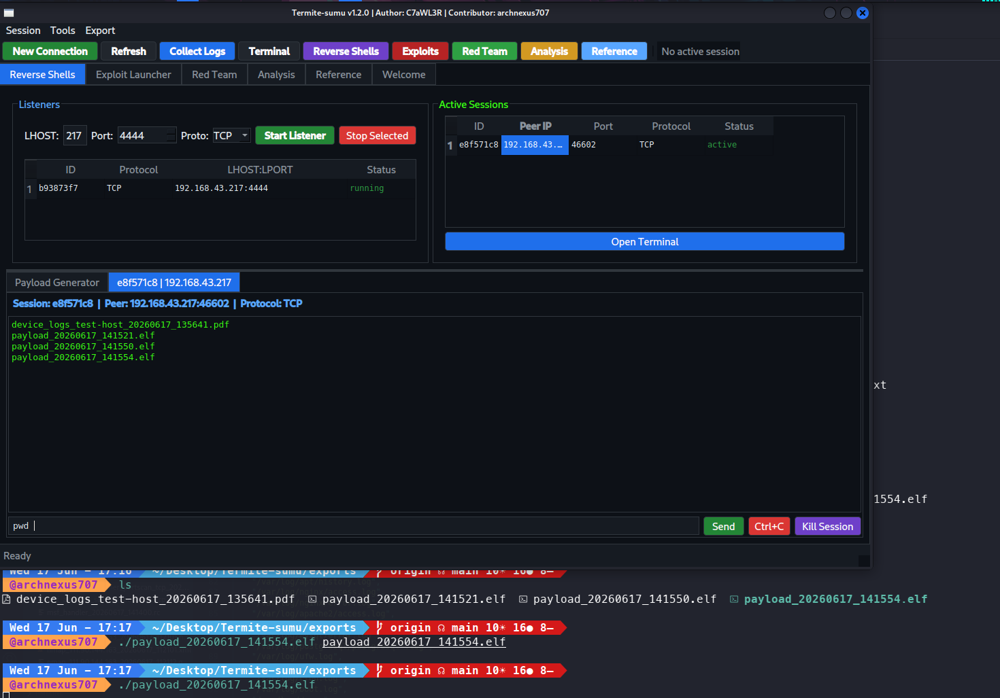

<p align="center">
  <br>
  
</p>

<p align="center">
  
  
  
  
  <br>
  
  
  
</p>

<br>

<p align="center">
  <b>Silent. Methodical. Lethal.</b> — like the insect it is named after.<br>
  A multi-protocol, multi-language red team & purple team operations platform<br>
  built for security professionals operating on Kali Linux.
</p>

<br>

<p align="center">
  
</p>

<br>

---

## ⚠️ LEGAL

> This tool is intended **exclusively** for authorized penetration testing, red team operations,
> and security research. Unauthorized use against systems you do not own or have explicit
> written permission to test is **illegal**. The authors assume no liability for misuse.

---

## 🎯 FEATURES

### 🔴 Red Team — Offensive Operations

| Domain | Capability | Tools Wrapped |
|--------|-----------|---------------|
| **Active Directory** | Enumeration, Kerberoast, DCSync, AS-REP, Certipy, BloodHound, ldapdomaindump | `impacket`, `bloodhound-python`, `certipy`, `kerbrute` |
| **Network Attacks** | LLMNR/NBT-NS poisoning, NTLM relay, IPv6 mitm6, PetitPotam coercion | `responder`, `ntlmrelayx`, `mitm6` |
| **Reconnaissance** | Subdomain enum, directory brute, vulnerability scanning, OSINT | `subfinder`, `amass`, `nuclei`, `gobuster`, `feroxbuster`, `theHarvester` |
| **Web Attacks** | SQL injection, parameter fuzzing, template scanning | `sqlmap`, `ffuf`, `nuclei` |
| **Exploit Launching** | One-click tool execution with live output streaming | `nmap`, `crackmapexec`, `evil-winrm`, `impacket`, `metasploit`, `hydra` |
| **Tunneling** | SOCKS proxy, reverse port forwarding, pivoting | `chisel`, `ligolo-ng`, SSH `-D` |

### 🟣 Purple Team — Evasion & Measurement

| Technique | Implementation |
|-----------|---------------|
| **Base64 encoding** | `echo PAYLOAD \| base64 -d \| bash` |
| **XOR obfuscation** | Random single-byte key → self-decoding Python stub |
| **PowerShell -EncodedCommand** | UTF-16LE → Base64 to bypass AMSI signature matching |
| **String concatenation** | Split payload into chunks → reconstruct at runtime |
| **Variable randomization** | Replace `$client`, `$stream` with random names |
| **JA3 TLS cipher shuffle** | Randomize cipher order per connection to evade JA3 fingerprinting |
| **HTTP beacon disguise** | C2 traffic wrapped as `POST /api/v1/telemetry` with legitimate User-Agent |
| **Process masquerade** | `exec -a kworker/u4:2` to hide in process list |
| **Detection timer** | Measure EDR/SIEM detection latency — Record send → Mark detected → Export report |

### 🔵 Blue Team — Detection & Analysis

| Module | Description |
|--------|-------------|
| **30 ATT&CK Signatures** | 15 Linux + 15 Windows regex-based detection rules |
| **3 Anomaly Detectors** | Brute force (IP correlation), log volume spike (4x baseline), off-hours login (7-19 window) |
| **IOC Scanner** | 8 categories: C2 frameworks, credential dumpers, exploits, ransomware, keyloggers, malware, anti-analysis, cryptocurrency |
| **YARA Integration** | Scan files against custom `.yar` rule sets |
| **Threat Scoring** | Weighted 0-100 score → Critical / High / Medium / Low verdict with remediation steps |
| **PDF Export** | Full report generation via `reportlab` with dark-themed styling |

### 🔧 Reverse Engineering

- **Binary static analysis** — file type detection, architecture identification (ELF/PE/Mach-O)
- **Shannon entropy profiling** — >7.5 = packed/encrypted, >6.8 = suspicious
- **Capability mapping** — auto-detect: Process Injection, Registry access, Anti-debug, Network, Crypto
- **Import/Export enumeration** — DLL dependencies, API calls via `readelf` / `objdump`
- **Packer detection** — UPX, ASPack, Themida, VMProtect signatures in strings
- **JSON export** — full analysis report with recommendations

### 🕵️ Steganography Detection

- **steghide** — embedded data detection + capacity check
- **binwalk** — file carving, embedded file extraction (JPEG, PNG, ZIP, ELF, PE)
- **LSB pixel analysis** — entropy-based anomaly detection in image LSB planes
- **Audio spectrograms** — visual analysis via FFmpeg `showspectrumpic`
- **Hidden string search** — keys, certificates, emails, passwords embedded in binaries

### ⚡ High-Concurrency Go Backend

```
127.0.0.1:9120 ─── REST API ─── Python PyQt6 GUI
     │
     ├── /health          — uptime, listener/session counts
     ├── /listeners       — start/stop/list TCP, SSL, HTTP-beacon
     ├── /sessions        — list, drain output, send commands, kill
     └── /payloads        — 11 reverse-shell one-liner types
```

- **Goroutine per connection** — scales to 10,000+ concurrent sessions
- **Ephemeral TLS certs** — auto-generated per SSL listener
- **0 external Go dependencies** — pure stdlib
- **Graceful shutdown** — SIGTERM → drain → close

### 🖥️ C++ Native Windows Exploitation

| Technique | MITRE | Implementation |
|-----------|-------|---------------|
| **CreateRemoteThread** | T1055.001 | `OpenProcess` → `VirtualAllocEx` → `WriteProcessMemory` → `CreateRemoteThread` |
| **LSASS Memory Dump** | T1003.001 | `SeDebugPrivilege` → `OpenProcess(LSASS)` → `MiniDumpWriteDump` |
| **AMSI In-Memory Patch** | T1562.001 | `VirtualProtect(AmsiScanBuffer)` → `mov eax, 0x80070057; ret` |
| **SYSTEM Token Steal** | T1134.001 | `OpenProcess(winlogon)` → `OpenProcessToken` → `DuplicateTokenEx` → `ImpersonateLoggedOnUser` |
| **Shellcode Executor** | — | `VirtualAlloc(RWX)` → `memcpy` → direct call |
| **Process Hollowing** | T1055.012 | Stub — requires PE relocation logic |

Cross-compile from Kali: `make -C cpp_native` (requires `mingw-w64`)

---

## 📸 SCREENSHOTS

<p align="center">
  
  <br>
  <sub><i>Main window — Reverse Shells tab with listener manager, payload generator, and evasion engine</i></sub>
</p>

---

## ⚙️ INSTALLATION

```bash
# Clone
git clone https://github.com/archnexus707/Termite-sumu.git
cd Termite-sumu

# System dependencies (Kali / Debian)
sudo apt install -y libsmbclient-dev python3-venv python3-pip mingw-w64

# Python virtual environment
python3 -m venv .venv && source .venv/bin/activate
pip install -r requirements.txt

# Optional: Go backend (high-concurrency listeners)
cd gobackend && go build -o termite-go-backend . && cd ..

# Optional: C++ native module (Windows exploitation)
cd cpp_native && make && cd ..

# Launch
python main.py
```

### Dry-Run Mode (Safe Demos)

```bash
export TERMITE_SUMU_DRY_RUN=1
python main.py
```

### Environment Variables

| Variable | Default | Effect |
|----------|---------|--------|
| `TERMITE_SUMU_DRY_RUN` | `0` | `1` = print commands, execute nothing |
| `TERMITE_SUMU_SSH_TOFU` | `0` | `1` = prompt on unknown SSH host keys |
| `TERMITE_SUMU_WINRM_INSECURE_TLS` | `0` | `1` = skip WinRM TLS validation (lab only) |

---

## ⌨️ KEYBOARD SHORTCUTS

| Key | Action |
|-----|--------|
| `Ctrl+N` | New Connection |
| `Ctrl+L` | Collect All Logs |
| `Ctrl+T` | Open Terminal |
| `Ctrl+R` | Reverse Shells |
| `Ctrl+E` | Exploit Launcher |
| `Ctrl+G` | Red Team Ops |
| `Ctrl+A` | Deep Analysis |
| `Ctrl+H` | Reference |
| `Ctrl+Q` | Quit |

---

## 🏗️ ARCHITECTURE

```
Termite-sumu/                         v1.2.0
│
├── 🐍 main.py                       Qt6 Application Entry
├── ⚙️ config/settings.py             Constants, env toggles, log sources
│
├── 🧠 core/                          Business Logic Layer
│   ├── reverse_shell.py              Listener Manager + 11 payloads
│   ├── exploit_launcher.py           6 tools (nmap, cme, evil-winrm, impacket, msf, hydra)
│   ├── redteam.py                    6 domains × 4-7 tools each
│   ├── evasion.py                    6 transforms + detection timer
│   ├── log_analyzer.py               30 ATT&CK sigs + 3 anomaly detectors
│   ├── validators.py                 SecureInputValidator
│   ├── audit.py                      Append-only audit logger
│   ├── go_bridge.py                  Python ↔ Go REST client
│   ├── reversing/                    Binary static analysis engine
│   ├── steg/                         Steganography detection pipeline
│   └── defense/                      IOC + YARA defense scanner
│
├── 🐹 gobackend/                     Go High-Concurrency Engine
│   ├── main.go                       HTTP server (127.0.0.1:9120)
│   ├── listener/manager.go           Goroutine-per-listener TCP/TLS pool
│   ├── session/manager.go            Per-connection session tracker
│   └── payload/generator.go          11 reverse-shell one-liners
│
├── ⚔️ cpp_native/                    C++ Windows Exploitation
│   ├── src/injector.cpp              6 techniques (injection, dump, AMSI, token)
│   └── Makefile                      x86_64-w64-mingw32-g++ cross-compile
│
├── 🖥️ gui/                           PyQt6 Desktop Interface
│   ├── main_window.py                Window, tabs, toolbar, status
│   ├── reverse_shell_tab.py          Listener + payload + evasion UI
│   ├── exploit_launcher_tab.py       Tool launcher with live output
│   ├── redteam_tab.py                6-category dashboard
│   ├── analysis_tab.py               Log analysis + findings table
│   ├── reference_tab.py              50+ searchable topics
│   ├── connection_dialog.py          SSH/WinRM/SMB/Telnet wizard
│   ├── terminal_widget.py            SSH interactive terminal
│   └── output_reader.py              Shared QThread subprocess reader
│
├── 📜 scripts/post_exploit/
│   └── linux_privesc_enum.sh         10-point Linux privilege escalation check
│
├── 📊 reports/pdf_report.py          reportlab PDF generator
└── 📋 HUNTED_BUGS_AND_ERRORS.txt     Full 8,500-line code audit

🐍 Python  |  🐹 Go  |  ⚔️ C++  |  📜 Bash
```

---

## 🎯 MITRE ATT&CK COVERAGE

| Tactic | Techniques Covered |
|--------|-------------------|
| **Initial Access** | T1190, T1566, T1078, T1078.004 |
| **Execution** | T1059, T1218, T1053, T1059.001, T1059.004 |
| **Persistence** | T1547.001, T1543.003, T1546.003, T1053.003, T1053.005, T1136.001, T1547.006 |
| **Privilege Escalation** | T1548.001, T1068, T1134, T1134.001, T1548.003 |
| **Defense Evasion** | T1027, T1553.002, T1070, T1562, T1562.001, T1562.002, T1055.001, T1055.012 |
| **Credential Access** | T1003, T1558.003, T1558.004, T1110, T1003.001, T1003.006, T1003.008, T1558.001 |
| **Discovery** | T1087, T1083, T1057, T1046, T1082 |
| **Lateral Movement** | T1021, T1550.002, T1572, T1021.002 |
| **Collection** | T1005, T1564.003 |
| **Command & Control** | T1071, T1071.001, T1041, T1090 |
| **Exfiltration** | T1048 |
| **Impact** | T1486 |

---

## 👥 AUTHORS

<table>
<tr>
<td align="center" width="50%">
  <b>C7aWL3R</b><br>
  <sub>Author</sub><br><br>
  <a href="https://github.com/C7aWL3R">
    
  </a>
</td>
<td align="center" width="50%">
  <b>archnexus707</b><br>
  <sub>Contributor — v1.2.0</sub><br><br>
  <a href="https://github.com/archnexus707">
    
  </a>
</td>
</tr>
</table>

### v1.2.0 Contributions by archnexus707

- **46 bug fixes** — critical (TLS, SSH policy, thread safety), severe (payload, CRLF, attribute mismatches), logical (session buffer, dead-send feedback)
- **Go backend** — high-concurrency listener/session/payload REST API engine
- **C++ native module** — 6 Windows exploitation techniques (injection, dump, AMSI, token)
- **Reverse engineering engine** — binary static analysis, entropy, capability mapping
- **Steganography detection** — steghide, binwalk, LSB, spectrograms
- **Defensive scanner** — IOC matching, YARA integration, threat scoring 0-100
- **Cross-platform protocol fixes** — CRLF/LF, Qt thread safety, signal marshalling
- **Full 8,500-line code audit** — documented in `HUNTED_BUGS_AND_ERRORS.txt`

---

## 📄 LICENSE

MIT — see [LICENSE](LICENSE)

> **Responsible Disclosure**: If you discover a security issue in this tool itself,
> please report it privately before public disclosure.

---

<p align="center">
  <sub>Built with ❤️ for the offensive security community</sub>
</p>
